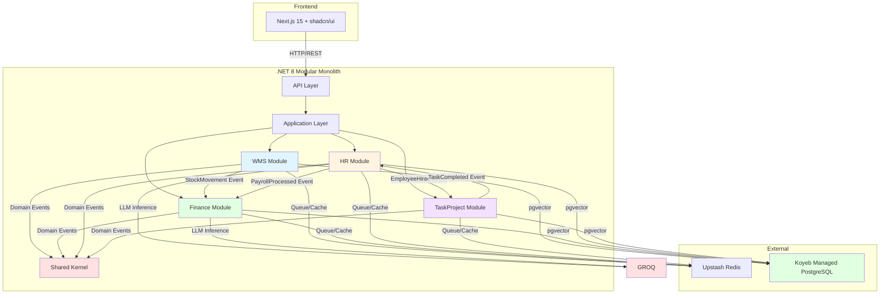

# Technical Design Document (TDD)

## Document Information
- **Document Version**: 2.0
- **Created Date**: 2026-06-29
- **Last Updated**: 2026-07-03
- **Author**: AI Engineer
- **Project**: FluxGrid ERP
- **Scope**: Complete ERP System (All Modules)

---

## 1. Introduction

### 1.1 Purpose
Technical design document untuk FluxGrid ERP - sistem Modular Monolith untuk industri berat (Mining, Oil & Gas, Logistics, Manufacturing). Dokumen ini mencakup desain teknis untuk semua 4 modul utama: WMS (Warehouse Management), Finance (General Ledger), HR & Payroll, dan Task & Project Management. Semua modul mengikuti Clean Architecture dengan DDD dan berkomunikasi melalui Domain Events.

### 1.2 Scope
**Included Modules:**

**1. WMS - Warehouse Management System**
- Stock Ledger dengan double-entry inventory
- Inbound/Outbound processing
- Valuation methods (FIFO, Average Cost)


**2. Finance - General Ledger & Reporting**
- Double-entry ledger (debit = kredit)
- Chart of Accounts management
- Period closing
- Financial reports (Trial Balance, P&L, Balance Sheet)
- Budget Management & Dashboard

**3. HR & Payroll**
- Employee data management
- Web-Based Attendance (PWA) dengan GPS Geofencing, AI Face Recognition, Offline Support
- Payroll engine dengan PPh 21
- HR Recruitment (CV parsing, job matching)
- AI Integration: CV Parsing, Candidate-Job Matching, Productivity Analytics, Face Recognition

**4. Task & Project Management**
- Kanban board
- Time tracking
- Task dependencies


**Shared Features:**
- Modular Monolith architecture dengan Clean Architecture dan DDD
- Domain Events untuk komunikasi antar modul
- RBAC dengan granular permissions
- Audit Trail immutable
- Row-Level Security (RLS)
- AI Service Layer abstraction (Groq API) — HR only

### 1.3 References
- PRD: docs/features/PRD.md
- README: README.md (FluxGrid ERP Technical Blueprint)
- Clean Architecture principles
- Domain-Driven Design (DDD)

---

## 2. System Architecture

### 2.1 High-Level Architecture
FluxGrid ERP adalah sistem Modular Monolith dengan 4 modul utama: WMS, Finance, HR, dan TaskProject. Setiap modul mengikuti Clean Architecture dengan layer: Domain, Application, Infrastructure, dan API. Komunikasi antar modul dilakukan melalui Domain Events via MediatR untuk menjaga loose coupling.

### 2.2 Architecture Diagram


---

## 3. Database Design

### 3.1 Entity Relationship Diagram

```mermaid
erDiagram
    %% WMS Entities
    inventory_items ||--o{ stock_ledger : "has movements"
    inventory_items ||--o{ purchase_receipts : "received in"
    inventory_items ||--o{ sales_orders : "ordered in"
    locations ||--o{ stock_ledger : "stored at"
    purchase_receipts ||--o{ pick_lists : "generates"
    sales_orders ||--o{ pick_lists : "requires"
    pick_lists ||--o{ shipments : "shipped in"
    
    %% Finance Entities
    chart_of_accounts ||--o{ journal_entry_lines : "used in"
    journal_entries ||--o{ journal_entry_lines : "has lines"
    periods ||--o{ journal_entries : "contains"
    journal_entries ||--o{ anomalies : "may be flagged as"
    
    %% HR Entities
    employees ||--o{ attendance : "has records"
    employees ||--o{ leaves : "requests"
    employees ||--o{ payroll_records : "paid in"
    organizational_units ||--o{ employees : "contains"
    positions ||--o{ employees : "assigned to"
    payroll_periods ||--o{ payroll_records : "contains"
    candidates ||--o{ candidate_education : "has"
    candidates ||--o{ candidate_experience : "has"
    candidates ||--o{ candidate_skills : "has"
    candidates ||--o{ candidate_job_matches : "matched with"
    job_postings ||--o{ candidate_job_matches : "matches with"
    
    %% TaskProject Entities
    projects ||--o{ tasks : "contains"
    tasks ||--o{ task_dependencies : "has"
    tasks ||--o{ time_logs : "logged against"
    tasks ||--o{ task_assignments : "assigned to"
    
    %% Shared Entities
    users ||--o{ audit_logs : "generates"
    roles ||--o{ permissions : "has"
    users ||--o{ roles : "assigned"
    tenants ||--o{ users : "contains"
```


---

## 4. API Design

### 4.1 API Endpoints

#### WMS Endpoints

**POST /api/v1/wms/purchase-receipts**
- **Description**: Create purchase receipt for inbound goods
- **Authentication**: Required (WMS:Write)

**POST /api/v1/wms/pick-lists**
- **Description**: Generate pick list for outbound order
- **Authentication**: Required (WMS:Write)

**POST /api/v1/wms/shipments**
- **Description**: Confirm shipment
- **Authentication**: Required (WMS:Write)

**GET /api/v1/wms/stock-ledger**
- **Description**: Get stock ledger with movements
- **Authentication**: Required (WMS:Read)

**GET /api/v1/wms/inventory**
- **Description**: Get current inventory levels
- **Authentication**: Required (WMS:Read)

---

#### Finance Endpoints

**POST /api/v1/finance/journal-entries**
- **Description**: Create journal entry
- **Authentication**: Required (Finance:Write)

**GET /api/v1/finance/chart-of-accounts**
- **Description**: Get chart of accounts hierarchy (nested tree or flat list)
- **Query Params**: `flat` (boolean, optional — returns flat list vs nested tree)
- **Authentication**: Required (finance.coa.read)

**POST /api/v1/finance/chart-of-accounts**
- **Description**: Create a new account
- **Request Body**: `code`, `name`, `parent_id` (optional), `type`, `is_active` (optional)
- **Validation**: Unique code per tenant, max 5 levels depth, circular reference check, type inheritance from parent
- **Authentication**: Required (finance.coa.manage)

**PUT /api/v1/finance/chart-of-accounts/{id}**
- **Description**: Update account details or deactivate
- **Request Body**: Partial — `code`, `name`, `parent_id`, `type`, `is_active`
- **Validation**: Circular reference on parent change, cascade deactivation to children
- **Authentication**: Required (finance.coa.manage)

**DELETE /api/v1/finance/chart-of-accounts/{id}**
- **Description**: Soft-deactivate account (cascades to children)
- **Validation**: Checks journal entry references before deactivation
- **Authentication**: Required (finance.coa.manage)

**POST /api/v1/finance/periods/{id}/close**
- **Description**: Close accounting period
- **Authentication**: Required (Finance:Admin)

**GET /api/v1/finance/reports/trial-balance**
- **Description**: Generate Trial Balance report
- **Authentication**: Required (Finance:Read)

**GET /api/v1/finance/reports/pl**
- **Description**: Generate Profit & Loss statement
- **Authentication**: Required (Finance:Read)

**GET /api/v1/finance/reports/balance-sheet**
- **Description**: Generate Balance Sheet
- **Authentication**: Required (Finance:Read)

---

#### HR Endpoints

**GET /api/v1/hr/employees**
- **Description**: List employees
- **Authentication**: Required (HR:Read)

**POST /api/v1/hr/attendance/clock-in**
- **Description**: Clock in for attendance
- **Authentication**: Required (HR:Write)

**POST /api/v1/hr/attendance/clock-out**
- **Description**: Clock out for attendance
- **Authentication**: Required (HR:Write)

**POST /api/v1/hr/payroll/process**
- **Description**: Process payroll for period
- **Authentication**: Required (HR:PayrollProcess)

**POST /api/v1/hr/recruitment/candidates/upload**
- **Description**: Upload CV file
- **Authentication**: Required (HR:CVWrite)

**GET /api/v1/hr/recruitment/candidates**
- **Description**: List candidates
- **Authentication**: Required (HR:CVRead)

**POST /api/v1/hr/recruitment/jobs**
- **Description**: Create job posting
- **Authentication**: Required (HR:CandidateManage)

---

#### TaskProject Endpoints

**GET /api/v1/task/projects**
- **Description**: List projects
- **Authentication**: Required (Task:Read)

**POST /api/v1/task/projects/{id}/tasks**
- **Description**: Create task in project
- **Authentication**: Required (Task:Write)

**PUT /api/v1/task/tasks/{id}/status**
- **Description**: Update task status
- **Authentication**: Required (Task:Write)

**POST /api/v1/task/tasks/{id}/time-logs**
- **Description**: Log time for task
- **Authentication**: Required (Task:Write)

**GET /api/v1/task/projects/{id}/kanban**
- **Description**: Get kanban board for project
- **Authentication**: Required (Task:Read)

---

#### Shared Endpoints

**GET /api/v1/auth/me**
- **Description**: Get current user info
- **Authentication**: Required

**POST /api/v1/auth/logout**
- **Description**: Logout user
- **Authentication**: Required

**GET /api/v1/audit-logs**
- **Description**: Get audit logs
- **Authentication**: Required (Audit:Read)

### 4.2 API Versioning Strategy
URL-based versioning: `/api/v1/`. Future versions will be `/api/v2/` with backward compatibility maintained for at least 6 months.

### 4.3 Domain Events Integration

Semua modul raises dan listens ke Domain Events untuk cross-module communication:

#### Events Raised by WMS
```csharp
// StockMovement - Raised when inventory moves in/out
public class StockMovement : IDomainEvent
{
    public Guid ItemId { get; }
    public decimal Quantity { get; }
    public string MovementType { get; } // "IN" or "OUT"
    public DateTime Timestamp { get; }
}

// StockOutAlert - Raised when stock level below reorder point
public class StockOutAlert : IDomainEvent
{
    public Guid ItemId { get; }
    public decimal CurrentStock { get; }
    public decimal ReorderPoint { get; }
}
```

#### Events Raised by Finance
```csharp
// AccountCreated - Raised when a chart of account is created
public sealed record AccountCreated(
    Guid AccountId, string Code, string Name, string Type,
    Guid? ParentId, Guid TenantId
) : IDomainEvent;

// AccountUpdated - Raised when an account is updated or deactivated
public sealed record AccountUpdated(
    Guid AccountId, string Code, string Name, string Type,
    bool IsActive, Guid TenantId
) : IDomainEvent;

// JournalEntryPosted - Raised when journal entry is posted
public class JournalEntryPosted : IDomainEvent
{
    public Guid JournalEntryId { get; }
    public decimal TotalAmount { get; }
    public DateTime PostedDate { get; }
}

// PeriodClosed - Raised when accounting period is closed
public class PeriodClosed : IDomainEvent
{
    public Guid PeriodId { get; }
    public DateTime ClosedDate { get; }
}

// BudgetThresholdExceeded - Raised when budget variance exceeds threshold
public class BudgetThresholdExceeded : IDomainEvent
{
    public Guid BudgetId { get; }
    public decimal VariancePercentage { get; }
}
```

#### Events Raised by HR
```csharp
// EmployeeHired - Raised when new employee is hired
public class EmployeeHired : IDomainEvent
{
    public Guid EmployeeId { get; }
    public Guid CandidateId { get; }
    public DateTime HiredDate { get; }
}

// PayrollProcessed - Raised when payroll is processed
public class PayrollProcessed : IDomainEvent
{
    public Guid PayrollPeriodId { get; }
    public decimal TotalAmount { get; }
    public DateTime ProcessedDate { get; }
}
```

#### Events Raised by TaskProject
```csharp
// TaskCompleted - Raised when task is completed
public class TaskCompleted : IDomainEvent
{
    public Guid TaskId { get; }
    public Guid EmployeeId { get; }
    public DateTime CompletedDate { get; }
}

// TimeLogUpdated - Raised when time log is updated
public class TimeLogUpdated : IDomainEvent
{
    public Guid TimeLogId { get; }
    public Guid EmployeeId { get; }
    public decimal Hours { get; }
}
```

#### Event Handler Example
```csharp
// Finance listens to PayrollProcessed from HR
public class PayrollProcessedHandler : INotificationHandler<PayrollProcessed>
{
    private readonly IJournalEntryService _journalService;
    
    public async Task Handle(PayrollProcessed notification, CancellationToken ct)
    {
        // Post payroll to journal entries
        await _journalService.PostPayrollEntryAsync(
            notification.PayrollPeriodId,
            notification.TotalAmount
        );
    }
}

// HR listens to TaskCompleted from TaskProject
public class TaskCompletedHandler : INotificationHandler<TaskCompleted>
{
    private readonly IProductivityService _productivityService;
    
    public async Task Handle(TaskCompleted notification, CancellationToken ct)
    {
        // Update employee productivity analytics
        await _productivityService.UpdateProductivityAsync(
            notification.EmployeeId,
            notification.TaskId
        );
    }
}
```

### 4.4 Error Handling
Standard error codes:
- 400: Bad Request (invalid input)
- 401: Unauthorized (missing/invalid token)
- 403: Forbidden (insufficient permissions)
- 404: Not Found (resource doesn't exist)
- 409: Conflict (duplicate, etc.)
- 429: Too Many Requests (rate limit exceeded)
- 500: Internal Server Error
- 503: Service Unavailable (external service down)

Error response format:
```json
{
  "success": false,
  "error": {
    "code": "RESOURCE_NOT_FOUND",
    "message": "Resource with specified ID not found",
    "details": {}
  }
}
```

---

## 5. Frontend Design

### 5.1 Component Architecture
```
fluxgrid-frontend/
├── app/
│   ├── (dashboard)/
│   │   └── page.tsx           # Main dashboard
│   ├── wms/
│   │   ├── stock-ledger/page.tsx
│   │   ├── inbound/page.tsx
│   │   ├── outbound/page.tsx
│   │   └── dashboard/page.tsx
│   ├── finance/
│   │   ├── chart-of-accounts/page.tsx
│   │   ├── journal-entries/page.tsx
│   │   ├── reports/page.tsx
│   │   └── dashboard/page.tsx
│   ├── hr/
│   │   ├── employees/page.tsx
│   │   ├── attendance/page.tsx
│   │   ├── payroll/page.tsx
│   │   ├── recruitment/
│   │   │   ├── candidates/page.tsx
│   │   │   ├── jobs/page.tsx
│   │   │   └── upload/page.tsx
│   │   └── dashboard/page.tsx
│   ├── task/
│   │   ├── projects/page.tsx
│   │   ├── kanban/page.tsx
│   │   └── time-tracking/page.tsx
│   └── auth/
│       └── login/page.tsx
├── components/
│   ├── shared/
│   │   ├── DataTable.tsx
│   │   ├── FormDialog.tsx
│   │   └── StatusBadge.tsx
│   ├── wms/
│   │   ├── StockLedgerTable.tsx
│   │   └── PickListCard.tsx
│   ├── finance/
│   │   ├── JournalEntryForm.tsx
│   │   └── ReportViewer.tsx
│   ├── hr/
│   │   ├── EmployeeCard.tsx
│   │   ├── AttendanceCalendar.tsx
│   │   └── CVUploader.tsx
│   └── task/
│       ├── KanbanBoard.tsx
│       └── TaskCard.tsx
└── hooks/
    ├── useWMS.ts
    ├── useFinance.ts
    ├── useHR.ts
    └── useTask.ts
```

### 5.2 State Management
- **State Management Library**: TanStack Query (React Query)
- **Global State**: Server state managed by React Query
- **Local State**: React useState/useReducer for component state
- **Module-specific hooks**: useWMS, useFinance, useHR, useTask

### 5.3 Routing
| Route | Component | Access Control |
|-------|-----------|----------------|
| /dashboard | Main Dashboard | Any authenticated user |
| /wms/stock-ledger | Stock Ledger | WMS:Read |
| /wms/inbound | Inbound Processing | WMS:Write |
| /wms/outbound | Outbound Processing | WMS:Write |
| /wms/dashboard | WMS Dashboard | WMS:Read |
| /finance/chart-of-accounts | Chart of Accounts (tree CRUD) | finance.coa.read |
| /finance/journal-entries | Journal Entries | Finance:Read/Write |
| /finance/reports | Financial Reports | Finance:Read |
| /finance/dashboard | Finance Dashboard | Finance:Read |
| /hr/employees | Employee List | HR:Read |
| /hr/attendance | Attendance | HR:Read/Write |
| /hr/payroll | Payroll | HR:PayrollProcess |
| /hr/recruitment/candidates | Candidates | HR:CVRead |
| /hr/recruitment/jobs | Jobs | HR:CandidateManage |
| /hr/dashboard | HR Dashboard | HR:Read |
| /task/projects | Projects | Task:Read |
| /task/kanban | Kanban Board | Task:Read/Write |
| /task/time-tracking | Time Tracking | Task:Write |
| /auth/login | Login | Public |

### 5.4 UI/UX Considerations
- Responsive design untuk tablet dan desktop
- Accessibility: WCAG 2.1 AA compliance
- Loading states untuk async operations
- Error boundaries untuk graceful error handling
- Progressive disclosure untuk complex data
- Keyboard shortcuts untuk power users
- Consistent UI patterns across all modules (shadcn/ui)
- Real-time updates untuk collaborative features
- Mobile-friendly untuk basic operations (attendance, time tracking)
- PWA Support: Attendance module accessible via installable web app dengan offline capability

---

## 6. Security Design

### 6.1 Authentication & Authorization
- **Authentication Method**: JWT Bearer Token via NextAuth v5 (Frontend) + .NET JWT Middleware (Backend)
- **Authorization Model**: RBAC (Role-Based Access Control)
- **Super Admin**: Role `Admin` bypasses all permission checks. Implemented via `RequireAssertion` in `Program.cs`:
  ```csharp
  policy.RequireAssertion(context =>
      context.User.HasClaim("permissions", permission) ||
      context.User.IsInRole("Admin"));
  ```
- **Granular Permissions**:
  - **WMS:** WMS:Read, WMS:Write, WMS:Admin
  - **Finance:** Finance:Read, Finance:Write, Finance:Admin, Finance:Audit, finance.coa.read, finance.coa.manage
  - **HR:** HR:Read, HR:Write, HR:PayrollProcess, HR:CVRead, HR:CVWrite, HR:CandidateManage
  - **TaskProject:** Task:Read, Task:Write, Task:Admin
  - **Shared:** Audit:Read, Audit:Write

### 6.2 Data Encryption
- **At Rest**: PostgreSQL encryption (Neon managed)
- **In Transit**: TLS 1.3 for all HTTP connections
- **PII Data**: Encrypted at rest, access restricted, logged in audit trail

### 6.3 Input Validation
- File type validation (WMS: documents, HR: CV files)
- File size validation (max 10MB)
- Email format validation
- SQL injection prevention via parameterized queries
- XSS prevention via output encoding
- CSRF protection for state-changing operations
- UUID validation for all ID parameters
- Decimal precision validation for financial amounts

### 6.4 Security Headers
| Header | Value | Purpose |
|--------|-------|---------|
| Strict-Transport-Security | max-age=31536000 | Enforce HTTPS |
| X-Content-Type-Options | nosniff | Prevent MIME sniffing |
| X-Frame-Options | DENY | Prevent clickjacking |
| Content-Security-Policy | default-src 'self' | Prevent XSS |
| X-XSS-Protection | 1; mode=block | XSS protection |
| Referrer-Policy | strict-origin-when-cross-origin | Control referrer info |
| Permissions-Policy | geolocation=(self), microphone=(), camera=(self) | Allow GPS & Camera for PWA Attendance |

---

## 7. Performance Considerations

### 7.1 Caching Strategy
- **Caching Layer**: Upstash Redis
- **Cache Keys**:
  - `wms:inventory:{id}` - Inventory levels
  - `wms:stock-ledger:{item_id}` - Stock ledger data
  - `finance:chart-of-accounts` - Chart of accounts hierarchy
  - `finance:ledger:{period_id}` - Ledger balances
  - `hr:employee:{id}` - Employee profile data
  - `hr:payroll:{period_id}` - Payroll calculations
  - `hr:candidate:{id}` - Candidate profile data
  - `hr:job:{id}:matches` - Job match results
  - `task:project:{id}` - Project data
  - `task:kanban:{project_id}` - Kanban board state
- **Cache Invalidation**: TTL-based (24 hours), manual invalidation on updates

### 7.2 Database Optimization
- **Query Optimization**: Use indexes on frequently queried columns
- **Connection Pooling**: Npgsql connection pooling (max 100 connections)
- **Read Replicas**: Not needed for initial scale
- **Vector Search**: pgvector ivfflat indexes for similarity search (HR recruitment)
- **Partitioning**: Consider table partitioning for large tables (journal_entries, stock_ledger)
- **Materialized Views**: For complex reporting queries (financial reports)

### 7.3 CDN & Asset Optimization
- Koyeb Edge CDN for static assets
- Image optimization for document previews
- Lazy loading for large data tables
- Code splitting by module (WMS, Finance, HR, TaskProject)

---

## 8. Scalability Design

### 8.1 Horizontal Scaling
- Serverless architecture auto-scales via Vercel (frontend) and Cloudflare Workers (backend)
- Stateless API design enables horizontal scaling
- Database connection pooling handles high concurrency

### 8.2 Vertical Scaling
- Not applicable due to serverless architecture
- Neon PostgreSQL scales vertically automatically

### 8.3 Load Balancing
- Vercel and Cloudflare Workers handle load balancing automatically
- No manual load balancer configuration needed

---

## 9. Monitoring & Logging

### 9.1 Logging Strategy
- **Logging Framework**: Serilog (.NET)
- **Log Levels**: Debug, Information, Warning, Error, Critical
- **Log Aggregation**: Vercel logs for frontend, Cloudflare logs for backend

### 9.2 Monitoring
- **Metrics**: API response time, error rate, module-specific metrics (WMS: stock levels, Finance: journal entry rate, HR: payroll processing time, TaskProject: task completion rate)
- **Alerting**: Vercel alerts for frontend errors, Cloudflare alerts for backend errors
- **Health Checks**: `/api/health` endpoint for system health

### 9.3 Error Tracking
- **Error Tracking Tool**: Sentry
- **Error Reporting**: Automatic error reporting with stack traces and user context

---

## 10. Deployment Strategy

### 10.1 Environment Configuration
| Environment | Purpose | Configuration |
|-------------|---------|---------------|
| Development | Local development | Local .NET, Neon dev database |
| Staging | Pre-production testing | Vercel preview, Neon staging |
| Production | Live production | Vercel production, Neon production |

### 10.2 CI/CD Pipeline
- GitHub Actions for CI/CD
- Stages: Lint → Test → Build → Deploy
- Automatic deployment on merge to main
- Preview deployments on PR

### 10.3 Deployment Process
1. Code pushed to GitHub
2. GitHub Actions runs tests
3. Build frontend (Next.js) and backend (.NET)
4. Deploy frontend to Vercel
5. Deploy backend to Cloudflare Workers
6. Run database migrations if needed

### 10.4 Rollback Strategy
- Vercel: Instant rollback to previous deployment
- Cloudflare Workers: Rollback via versioned deployments
- Database: Migration rollback scripts

---

## 11. Testing Strategy

### 11.1 Unit Testing
- **Framework**: xUnit (.NET), Jest (React)
- **Coverage Target**: 80%
- **Key Test Areas**: Business logic (all modules), validation, parsing logic, domain events handlers

### 11.2 Integration Testing
- **Framework**: xUnit with TestServer (.NET)
- **Test Scenarios**: API endpoints (all modules), database operations, domain events propagation

### 11.3 End-to-End Testing
- **Framework**: Playwright
- **Test Scenarios**: 
  - WMS: Purchase receipt flow, pick/pack/ship flow
  - Finance: Journal entry creation, period closing, report generation
  - HR: Employee onboarding, attendance tracking, payroll processing, CV upload flow
  - TaskProject: Task creation, kanban board operations, time logging

### 11.4 Performance Testing
- **Tools**: k6
- **Test Scenarios**: 
  - Load test stock ledger updates (100 concurrent)
  - Load test journal entry posting (50 concurrent)
  - Load test payroll processing (10 concurrent)
  - Load test CV upload (50 concurrent)
  - Load test kanban board updates (50 concurrent)

---

## 12. Development Guidelines

### 12.1 Code Style
- **Linting**: ESLint + Prettier (React), StyleCop (.NET)
- **Code Review Process**: Required for all PRs, minimum 1 approval
- **Commit Conventions**: Conventional Commits (feat:, fix:, docs:, etc.)

### 12.2 Documentation Standards
- XML documentation for public APIs (.NET)
- JSDoc for React components
- README for each module

### 12.3 Branching Strategy
- Trunk-based development
- Feature branches for new features
- PR required for merge to main

---

## 13. Assumptions & Dependencies

### 13.1 Assumptions
- Neon PostgreSQL supports pgvector extension
- Users will adopt ERP system for daily operations
- Existing business processes can be mapped to ERP workflows

### 13.2 External Dependencies
| Dependency | Version | Purpose |
|------------|---------|---------|
| Groq API | Latest | LLM inference (HR: CV parsing) |
| Neon PostgreSQL | Latest | Database with pgvector |
| Upstash Redis | Latest | Caching and queue |

### 13.3 Internal Dependencies
- Shared Kernel (domain events, audit trail, RBAC)
- Existing Auth system (NextAuth v5 + JWT)

---

## 14. Risks & Mitigation

| Risk ID | Risk Description | Probability | Impact | Mitigation Strategy |
|---------|-----------------|-------------|--------|---------------------|
| **Technical Risks** |||||
| TR-001 | Groq API rate limits exceeded (HR) | Medium | High | Queue system, caching, graceful degradation |
| TR-002 | LLM hallucination in AI features | Medium | High | Confidence scoring, human review, validation |
| TR-003 | pgvector performance degradation | Low | Medium | Index maintenance, query optimization |
| TR-004 | Data privacy breach | Low | Critical | Encryption, RBAC, audit logs |
| **Business Risks** |||||
| TR-005 | User adoption resistance | Medium | Medium | Training, onboarding guide, phased rollout |
| TR-006 | Data migration complexity | Medium | High | Phased migration, data validation, rollback plan |
| **Compliance Risks** |||||
| TR-007 | Non-compliance with industry regulations | Low | Critical | Legal review, compliance audit, regular updates |

---

## 15. Future Considerations

### 15.1 Planned Enhancements
- **WMS:** Barcode scanning integration, mobile app for warehouse staff
- **Finance:** Multi-currency support, advanced analytics
- **HR:** Performance reviews, training management, benefits administration
- **TaskProject:** Gantt charts, resource leveling, project templates
- **Overall:** Mobile app for basic operations, advanced analytics dashboard, multi-language support

### 15.2 Technical Debt
- Consider migrating from Groq to self-hosted LLM if cost becomes prohibitive (HR only)
- Evaluate vector database alternatives if pgvector performance degrades
- Consider microservice extraction for high-load modules
- Implement more sophisticated AI algorithms based on feedback

---

## 16. Approval

| Role | Name | Signature | Date |
|------|------|-----------|------|
| Technical Lead | | | |
| Software Architect | | | |
| DevOps Engineer | | | |

---

## 17. Change History

| Version | Date | Author | Description of Changes |
|---------|------|--------|----------------------|
| 1.0 | 2026-06-29 | AI Engineer | Initial version - Complete FluxGrid ERP TDD covering all 4 modules (WMS, Finance, HR, TaskProject) |
